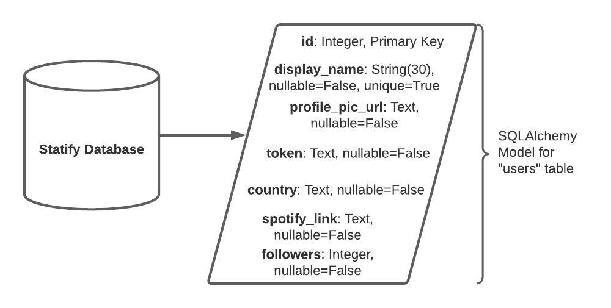

# Capstone-One-Spotify-Statistics
Website Name: Statify
Website URL: https://statify-winford.herokuapp.com/

Statify uses information from the Spotify API to display a user's top ten tracks and artists for all time, six months, and four weeks. The website redirects to a Spotify authorization page on login where a user can accept or deny the permissions needed for getting their profile and personal history highlights. If the user accepts the prompted permissions then the spotify API grants the user a unique token for that user, and session, which is used for making the calls to get the user's profile information and listening highlights. The user is then shown the home page with their top tracks and artists of all time listed. On this home page the user can select from among the three time ranges for tracks and artists as well as logout, and view their profile page. On their profile page the user can visit their Spotify profile by direct link and edit their account information. The account information for a user is superficial besides their session token and is stored in the site database.

The main feature of this website is displaying the user's listening highlights at the time of writing this Spotify has not fully implemented this feature into their website or app. Although Spotify does have part of this feature implemented in their website and Spotify wrapped uses the same information. The feature of a user account is necessary for the storage of the session token and it adds to the personal nature of the site.

Database Schema:

The table is represented the same way it is defined, in it's Flask SQLAlchemy form.

To run the Jasmine tests for the javascript functions in script.js certain lines must be uncommented. These lines can be found at the bottom of authorize.html, home.html, and profile.html. When uncommented these lines contain the test script links for the respective tests for each page. The Jasmine printout can then be found at the bottom of each page.
The Jasmine tests can be found in the static/ folder inside the following files authorize.test.js, home.test.js, and profile.test.js.

To run the unittests for the Python use the following command while inside the home directory for the downloaded copy of Statify being used:
$ python -m unittest app_tests.py models_tests.py updates_data_tests.py

The API being used for this site is the Spotify API. I will only use three parts of the api: authorization, personalization, and user profile. 

The endpoint for the personalization part of the API is https://api.spotify.com/v1/me/top/{type} and the link to the docs is https://developer.spotify.com/documentation/web-api/reference/#endpoint-get-users-top-artists-and-tracks.

For the user profile the endpoint is https://api.spotify.com/v1/me and the link to the docs is https://developer.spotify.com/documentation/web-api/reference/#endpoint-get-current-users-profile. 

Finally the authorization section has documentation at this link https://developer.spotify.com/documentation/general/guides/authorization-guide/ and it covers all parts of authorizing a user. 

The overall API link is https://developer.spotify.com/documentation/web-api/ .

Front End:
HTML
Java Script (including axios and jquery)
Jinja Templates
CSS

Back End:
Python
Flask
flask_sqlalchemy
PostgreSQL
Spotify API
and Heroku as the web server

Photo Credits:
https://unsplash.com/photos/F-B7kWlkxDQ
Travis Yewell on Unsplash,
https://unsplash.com/photos/vGXHIh3URzc
Mick Haupt on Unsplash,
https://unsplash.com/photos/H4fYXZ1hyco
and Heidi Fin on Unsplash

The favicon is original by Jack Winford but does include an edited copy of 
the Spotify icon.

This branch is designed to run on Heroku and use the Heroku PostgreSQL database.